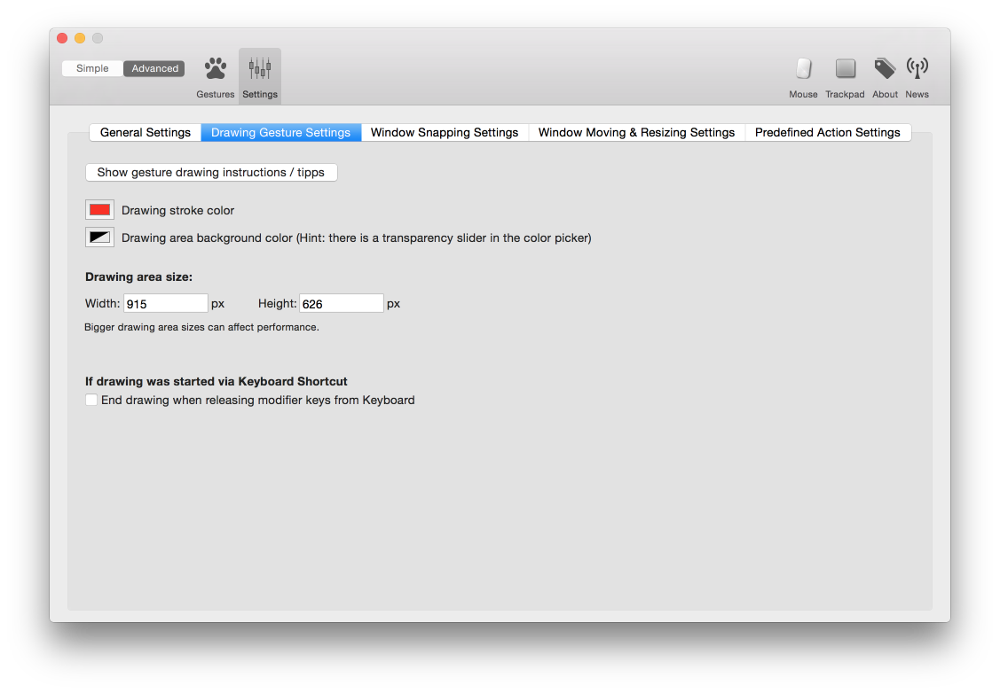

#Custom Drawing Gestures

##Known Limitations
* Currently the custom gesture recognizer does not recognize straight lines very well. Try to use more complex strokes (like cursive letters, arrows etc.)

##Adding New Gestures

* Click the "Add New Drawing" button in the Drawings tab
* Draw your gesture in the white drawing area
* To improve recognition reliability add some variations of the same gesture by clicking the button and drawing it again.

**Advanced:**

* You can choose the required certainty to trigger a gesture. The default is 0.7, I do not recommend values higher than 0.85.
* If your gesture should not depend on direction (e.g. a circle which can be drawn clockwise or counter-clockwise), check the checkbox on the bottom right

<video   width="80%" controls style="margin-bottom:20px; max-width:1000px" src="media/addingGestures.mov"></video>

##Using the Gestures

* You have to start drawing gesture recognition with either a trackpad or Magic Mouse gesture, a shortcut or a mouse button
* The predefined action you have to assign in order to start drawing is called **"Start Recording Mouse Gesture"** and is located in **"BTT Related Actions"**
* BTT will try to recognize your drawing after you remove your finger from the trackpad or Magic Mouse, or after releasing the mouse button

<video   width="80%" controls style="margin-bottom:20px; max-width:1000px" src="media/usingGestures.mov"></video>

##Which gestures do you use to start drawing recognition?

* On the Magic Mouse I like to use "Three finger click" or "Two Finger Touch Top"
* On the trackpad I like to use Three Finger Tap, Click or  Two Finger Tip Taps.

**However** this does not mean those are the best suited gesture, just my favorites. You can use any gesture you want to start drawing recognition
You can also use keyboard shortcuts or normal mouse buttons to start drawing recognition!

##Tipps & Tricks

* Gestures resembling cursive letters usually work pretty well
* Here are some gestures that worked well for me, but there are many many more ;-)

<video   width="80%" controls style="margin-bottom:20px; max-width:1000px" src="media/exampleGestures.mov"></video>

##Some Drawing settings are available in the Advanced Settings:

***BTT's drawing gesture recognition is based on the $1 Unistroke Recognizer implementation by Chris Miles. For more information see <a href="https://github.com/chrismiles/CMUnistrokeGestureRecognizer">https://github.com/chrismiles/CMUnistrokeGestureRecognizer</a> ***            
  
