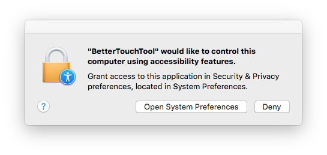
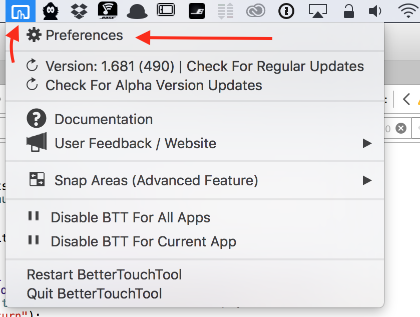

##Installation
**Installing BetterTouchTool is easy.**

1. Download BetterTouchTool from https://boastr.net/downloads/
2. Unzip the downloaded zip file (please use the Apple default unarchiver tool, others sometimes cause issues)
3. Move the unpacked BetterTouchTool.app to your applications folder
4. **Done!** You can now double-click to start BetterTouchTool
5. Continue with the initial setup to get BetterTouchTool up and running.

##Uninstall
If you ever need to uninstall BetterTouchTool, just delete it's app file from your Applications folder (or the folder you put it after downloading & unzipping it).

If you also want to get rid of BetterTouchTool's settings files (usually only a few KB, thus that's not really necessary), delete:

1. ~/Library/Application Support/BetterTouchTool
2. ~/Library/Preferences/com.hegenberg.BetterTouchTool.plist

##Buy License
You can use the BetterTouchTool trial version for 45 days without limitation. Afterwards you need to buy a license. For more information please see [https://boastr.net/buy/]()

##Activate License
In order to activate your license, just double-click your license file. If you do not have your license file and your original download link has already expired, you can recover your license here: http://lostlicense.boastr.net (or directly in the BetterTouchTool registration view)

##Initial Setup
After starting BetterTouchTool for the first time you may see this message popup quite often:

**"BetterTouchTool" would like to control this computer using accessibility features** 
Grant access to this application in Security & Privacy preferences, located in System Preferences.:

This message pops up because BetterTouchTool uses an API called "Accessibility API". That API is necessary for many of BetterTouchTool's core functions. It is therefore required to enabled it if you want to continue using BetterTouchTool.

The Accessibility API was made for accessibility tools like screen readers or other tools that may help people with disabilities to use their computers. This is why it offers some functionality that is normally not available to apps. For example the whole window snapping features in BetterTouchTool are only possible because of the accessibility API.

Normal applications only have access to their own windows, controls etc..  Only by using the Accessibility API we get access to other apps and can control them. This is both very powerful but also dangerous because malicious applications could use this for bad things. This is why Apple shows the above warning message for any app that wants to use the API.

To allow BetterTouchTool to use the Accessibility API go to System Preferences => Security & Privacy => Privacy => Accessibility, see:

##Configuring your first Gesture
Before adding your first gesture or shortcut, you need to open the BetterTouchTool preferences window. It is accessible via the menubar icon.

Here is a short video that shows how to add a Magic Mouse and how to add a Trackpad gesture. For more detailed instructions on how to add gestures or other triggers, have a look at the [Preference: Adding a new gesture](preferences_new_gesture.md)

<video width="100%" controls style="margin-bottom:20px; max-width:1200px">
  <source src="media/menubar.mp4" type="video/mp4">
Your browser does not support the video tag.
</video>

###General steps to configure a new gesture/shortcut:
1. Select the type of device you want to create the gesture for from the top tab bar (e.g. *Trackpad*).
2. Select the application you want to create the gesture for from the application list (or global if it should work everywhere).
3. Click the "Add New Shortcut" button
4. Select a gesture, then assign a shortcut or predefined action.

