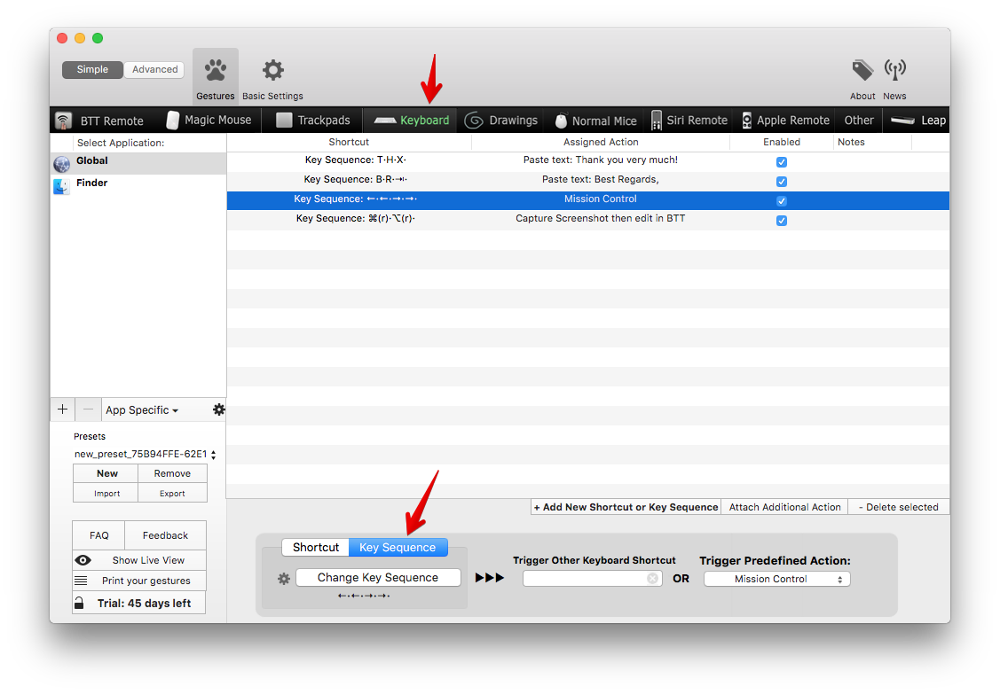
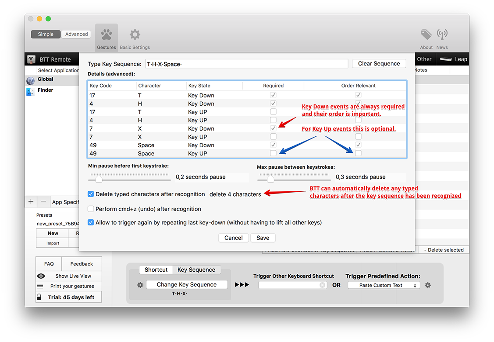

#Key Sequences

Key Sequences are a powerful new feature available starting with BetterTouchTool 1.74. A Key Sequence can be any sequence of key presses.

For example:
* Key Sequences allow you to trigger any BTT actions by typing words
* Key Sequences allow you to trigger actions by only pressing modifier keys
* Key Sequences allow you to trigger actions by pressing one or more keys multiple times in sequence
* You can use Key Sequences to expaned typed text by combining them with the "Paste Custom Text" predefined action
* Key Sequences do *not* block the input events generated by the pressed characters. However you can make them delete any typed text directly after triggering the action.

