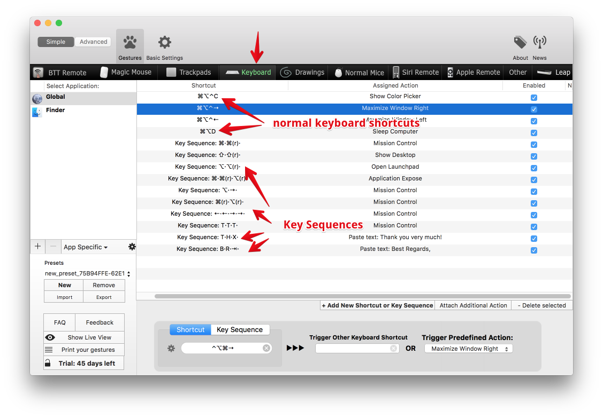

#Keyboard

This chapter describes the various ways to set up keyboard shortcuts or key sequences in BetterTouchTool.

* [Adding Keyboard Shortcuts](normal_keyboard_shortcuts.md)
* [Adding aribtrary Key Sequence triggers](key_sequences.md)
* [Sending shortcuts to specific applications](sending_shortcuts_to_specific.md)

