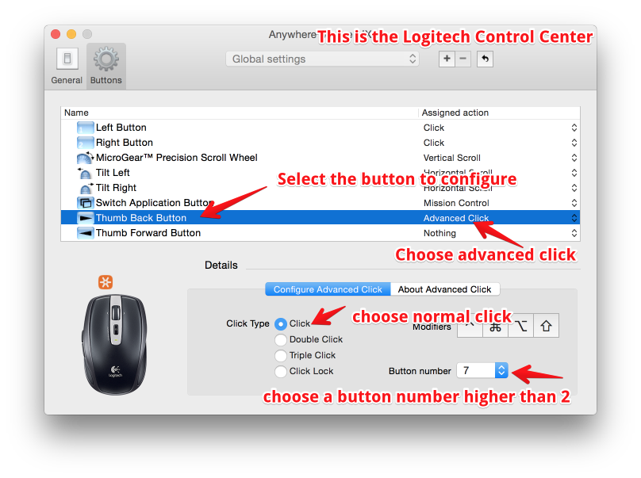
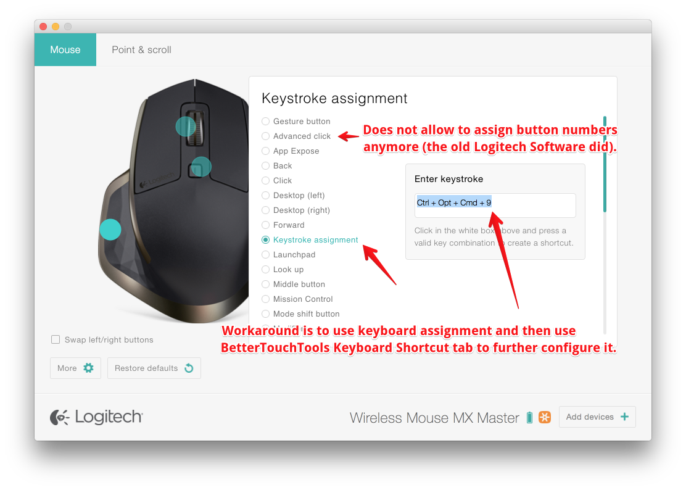

##How to make BetterTouchTool recognize your Mouse Buttons
BetterTouchTool can recognize mouse button presses if the mouse driver generates standard button events. Unfortunately many newer mice don't do this by default.

###Logitech Mice
* If you have a Logitech  mouse which comes with the <strong>"Logitech Control Center"</strong> application (installed as a prefpane in your System Preferences). Follow this screenshot:</li>

* If you are using one of the new Logitech mice which comes with the <strong>"Logitech Options"</strong> Software (installed as a prefpane in your System Preferences) the only option is to use the workaround described in the following screenshot. Unfortunately Logitech removed the functionality to assign specific mouse buttons (see <a href="https://forums.logitech.com/t5/Mice-and-Pointing-Devices/MX-Master-Logitech-Options-SW-Feature/td-p/1377773">https://forums.logitech.com/t5/Mice-and-Pointing-Devices/MX-Master-Logitech-Options-SW-Feature/td-p/1377773</a>)  </li>

* The same workaround just described also works for mice that come with the "Logitech Gaming Software" (which also does not allow to assign mouse buttons directly).
* If you have the Logitech MX Master mouse, make sure to connect it directly via Bluetooth and not via the Unified USB Receiver. Also make sure you have the Logitech Software INSTALLED.
In the Logitech Software make sure to disable all buttons you want to use in BTT (set their action to "none")
* If the information above did not help you, you may have to uninstall the Logitech Software.

To uninstall the Logitech Software, go to the Utilities folder in your Applications folder, the Logitech uninstaller Software should be there.

##Other Mice

If you have installed any driver/software for your mouse, make sure to not assign any actions to the buttons in that software. If this doesn't help try to uninstall the driver/software. If your mouse buttons are still not being recognized afterwards, your mouse is most likely not supported in BTT. Some mice also act as keyboard - you may try if a shortcut is recognized in BTT's keyboard tab when pressing a button.

