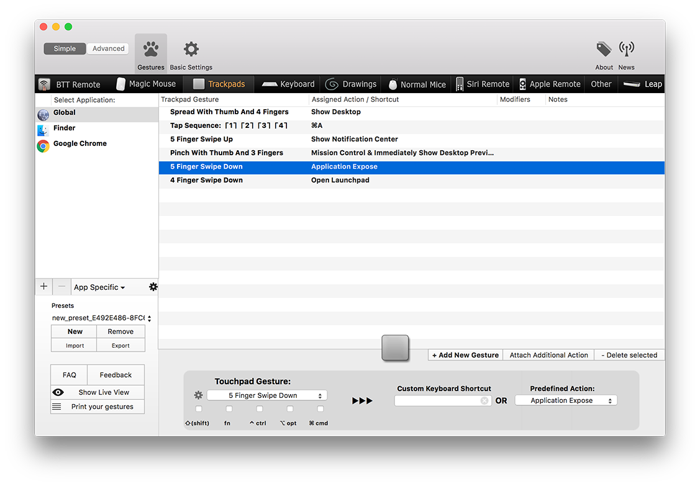
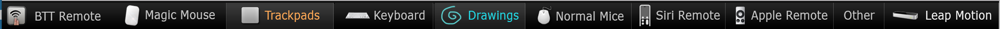
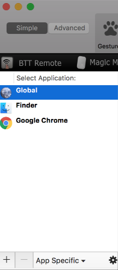

#Basic Preferences Overview
This section wants to give you an overview of the BetterTouchTools preferences. The window you see in the screenshot below is where you can configure almost every feature available in BetterTouchTool (and there are many 😉)

Let's dive into the different parts of that window:

##Tab Bar
The black tab bar on the top of the window is where you select the type of trigger you want to configure.

You can choose between: 

* **BTT Remote**: Here you can configure the companion App BTT Remote (which is free for everybody who bought BetterTouchTool)
* **Magic Mouse**: Configure gestures for the Magic Mouse 1 & 2
* **Trackpad**: Configure gestures for any multitouch capable Apple Trackpad currently on the market (The various Macbook's built-in trackpads, the Magic Trackpad 1 & 2)
* **Keyboard**: Configure keyboard shortcuts
* **Drawings**: Configure custom drawing gestures.
* **Normal Mice**: Reconfigure your normal mouse buttons.
* **Siri Remote**: Configure gestures & buttons on the new Siri Remote that comes with the new Apple TV
* **Apple Remote**: Configure gestures for the old Apple Remote
* **Other**: Contains all triggers that do not fit into any other category.
* **Leap Motion**: Configure gestures for the Leap Motion hardware. This feature is currently **not being developed actively in BetterTouchTool anymore**

!!!note
	Right-click the tab bar if you want to hide elements you do not need.
	
##Application List
Actions in BetterTouchTool can either be assigned to a specific application or globally. 
To add a new application click the ➕ button on the bottom left of the list (or alternatively drag an app directly onto the list from Finder). To delete an application press the ➖ button. 
**Pressing the - button will delete the application and all gestures / triggers you have associated with it.**

## Copying Gestures, App Specifics
* You can drag gestures onto apps in the list. This will create an exact copy of the gesture for that app.
* You can click the *App Specific* button which allows you to copy all gestures from one app to another app. The button also allows you to disable *single finger scrolling*, *window snapping* or the whole *BetterTouchTool* for a specific application.

<video width="100%" controls style="margin-bottom:20px; max-width:1200px">
  <source src="media/draggesture.mp4" type="video/mp4">
Your browser does not support the video tag.
</video>