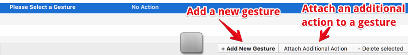
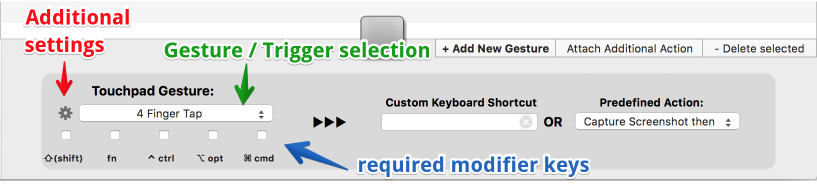
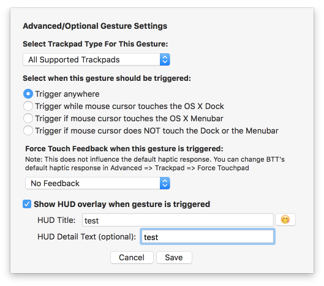
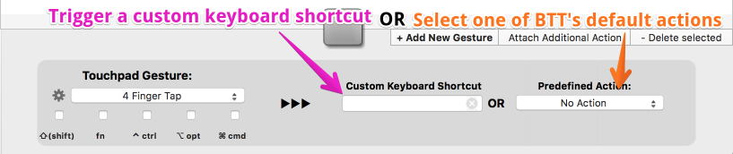

#Setting up a new Gesture
After you selected the device type from the tab bar (e.g. "Trackpad") you can press the "Add New Gesture" button:

After pressing the *Add new gesture* button a new row will be added to the table and you can begin to configure a new gesture.
I'm using the trackpad tab as an example here, but the procedure is very similar for all other types of triggers.

You'll see these configuration options after selecting a row from the table. Let's first look at the left part:

1. First you may want to select the gesture type, this can be done by clicking the the gesture selection button (green arrow).
2. If you want a gesture to ***only work while pressing specific modifier keys***, you can choose those via the checkboxes (marked with the blue arrow).
3. The little gear icon on the left side of the "gesture selection button" (red arrow) allows you to select some more advanced options:

**As you can see you can:**

* Select the device subtype the gesture should work on (e.g. Magic Trackpad or internal Trackpad)
* Select more advanced trigger conditions (e.g. only trigger while hovering the dock or menubar)
* In case you have a force touch trackpad you can select some haptic feedback that happens when the gesture is recognized.
* You can configure a HUD that shows up when the gesture is recognized. (similar to the one that appears when pressing the volume keys on the keyboard) 

##Assigning an action to a gesture

We haven't actually defined what the gesture should do yet, only when and how it's triggered. Let's have a look at the right part of the configuration options:

**There are two basic options you have:**

1. Trigger a custom keyboard shortcut
2. Trigger one of BetterTouchTool's default actions

To **trigger a shortcut**, just click into the "*Custom Keyboard Shortcut Textfield*" and press the keys you want to trigger (e.g. if you click into the field and press ***CMD*** and ***C*** at the same time, your gesture will be able to copy something to your clipboard by triggering the cmd+c shortcut) 

To **trigger one of BTT's default actions** just click the *Predefined Action* dropdown button and choose the action you want to use. Many of the actions are quite powerful and can be used for various tasks, e.g. you can run Apple Scripts, Launch Apps, Trigger Menubar Menu Items, send Shortcuts to specific applications and so on. People have been quite creative using the actions available in BetterTouchTool 😊

For more information about the various predefined actions, please have a look at the [Predefined Actions Section](predefined_actions.md)

##Triggering multiple Actions/Shortcuts with one gesture

BetterTouchTool also let's you trigger multiple actions or keyboard shortcuts with just one gesture. To do this, use the "***attach additional action***" button:

