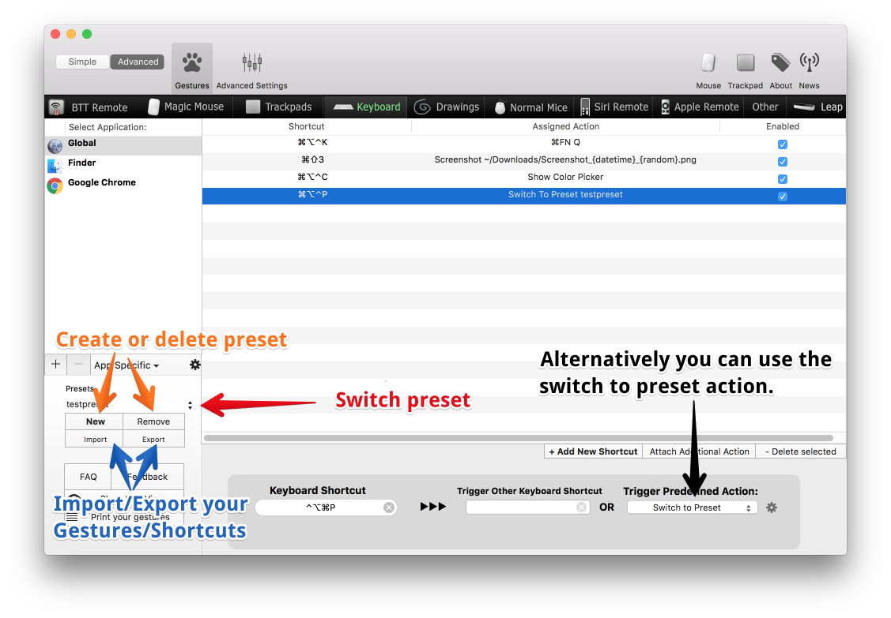

#Presets
The preset functionality in BetterTouchTool allows you to save or restore your complete gesture/shortcut configuration to/from a single file and thus easily switch between different setups.
 

##Creating a new Preset
To create a new preset, click the "**New**" button (orange arrows). This will add an item to the list of presets.
The default name is something like *new_preset_randomcharacters*. 
To rename a preset, triple-click the default name and enter a new one. Press enter to confirm the new name.

##Import/Export settings
With the import export buttons (blue arrows) you can import existing presets or export your current gesture/shortcut configuration.

The default BetterTouchTool preset is saved in ~/Library/Application Support/BetterTouchTool/bttdata2
##Switching Presets
To switch between presets either open the preset dropdown menu (red arrow) or use the predefined action **Switch To Preset** (black arrow)

The predefined action also allows you to cycle through different presets, to achieve this just add the action to each preset and make it switch to the next/other one.

!!!warning
	I know that the preset handling in BetterTouchTool (as of v1.69) is kind of buggy. I plan to add much more powerful import/export functionality soon, which will fix many issues. This will then also allow to partially export settings (e.g. only the Magic Mouse tab)

