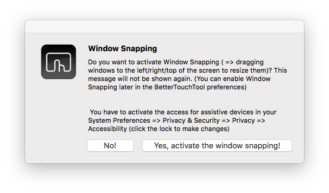
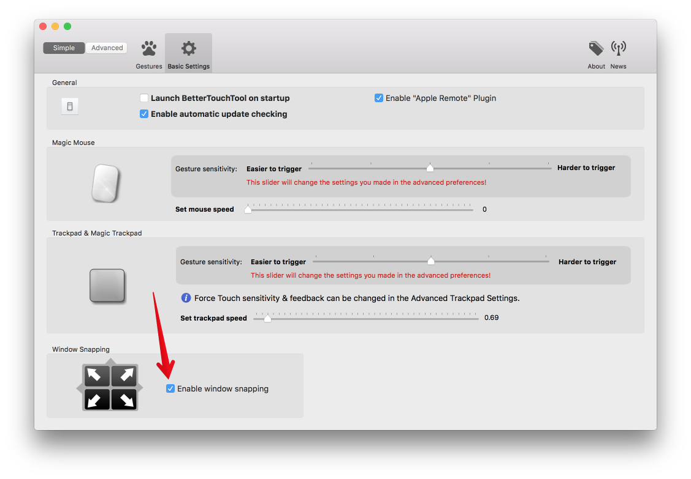

#Window Snapping
Window snapping is a very powerful feature in BetterTouchTool. It allows you to easily arrange windows on your Mac by e.g. using a normal mouse, multitouch gestures or keyboard shortcuts.

<video width="100%" controls style="margin-bottom:20px; max-width:1200px">
  <source src="media/windowsnapping.mp4" type="video/mp4">
Your browser does not support the video tag.
</video>

#Basic Window Snapping Setup
**When opening BetterTouchTool for the first time** it'll ask you whether you want to use widow snapping. If you answer this with **yes** BetterTouchTool will enable the mouse based window snapping for you.

If you  chose no, but now want to enable window snapping, go to **Preferences -> Basic Settings** and check the ***Enable window snapping*** checkbox.

