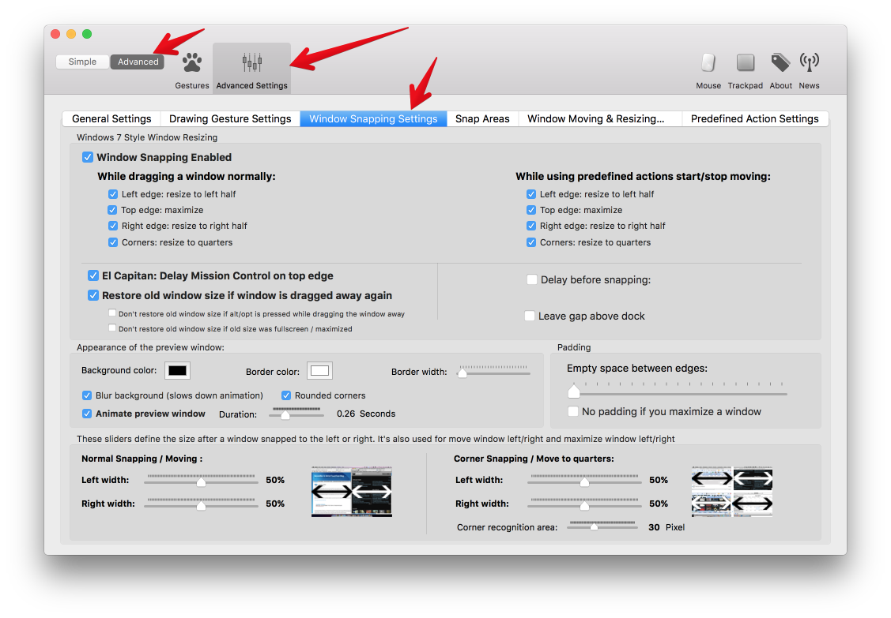
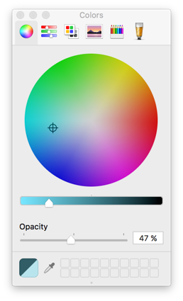

#Advanced Window Snapping Setup
BetterTouchTool's window snapping is very customizable. You can change the appearance but also the behavior to fit your style & workflow. All customization options are not visible while in **simple settings mode**, thus if you want to do any customization you need to enable the **advanced settings mode**. See this screenshot:

##Only Enable Specific Window Snapping Areas
You can choose where windows shall be able to snap to. The options are **left edge, top edge, right edge and corners**.
You may notice that those options are available twice in the Preferences window, once they are titled **While dragging window normally** and once they are labelled **While using predefined actions start/stop moving**.

Dragging a window normally means dragging it with your mouse's or trackpad's default "click & drag" functionality like you would usually drag around a window. 
Additionally BetterTouchTool has two predefined actions called "Start moving" and "Stop moving" (those are pretty great when combined with the "two finger touch top" gesture for the Magic Mouse).

**Warning**
	There currently (Version 1.69) seems to be a bug that causes BetterTouchTool to ignore the **"While using predefined actions start/stop moving"** options. I'll soon look into this.
git cl

###El Capitan: Delay Mission control on top edge
*This option is enabled by default if BetterTouchTool is running on OS X 10.11 (El Capitan).* 

In El Capitan Apple added a feature that unfortunately kind of conflicts with BetterTouchTool's window snapping: When dragging a window beyond the top edge of the screen Mission Control opens.
On the one hand this is a great feature, however it will often accidentally trigger while trying to snap a window to the top with BetterTouchTool. This is why I have added an option to "delay" this feature while BetterTouchTool is running.

When this option is activated you'll have to move your cursor further beyond the top edge of the screen in order to trigger the Apple feature. So actually "delay" may be the wrong term, and I should probably change it. 
###Restore old window size if window is dragged away again
*This option is activated by default*

If activated BetterTouchTool will try to restore the size a window had before snapping to one of the snap areas when you drag it away again later.

You can additionally enable the option "Don't restore window size if alt/opt is pressed while dragging the window away" or "Don't restore if window size was fullscreen / maximized"

###Delay before snapping
I don't know if this option is used by anybody, but it allows you to add a delay before a window will snap to the edges or corners of the screen.
###Leave gap above dock
Some uses wanted to be able to leave a little gap above the dock when snapping windows. You can do this with this option. 
##Appearance
###Background & Border Color:
With these options you can change the colors of the window snapping preview overlay (background & border). The default OS X color picker is used, don't miss the opacity slider where you can set the transparency.

### Border Width
Changes the border width of the window snapping preview overlay.
### Blur background:
This is currently not working (at least on El Capitan). I'll look into this soon.
###Padding / Empty space between edges
Add empty space between the snapped windows and other windows or the edges of the screen.

###Width Sliders
With the width sliders on the bottom of the advanced window snapping preferences you can change the default window width when snapping to the left or to the right side of the screen.

###Custom Snap Areas
If you need more customization options and maybe even want to snap your windows to other positions & sizes than offered by default, have a look at the [Custom Snap Area Section](snap_areas.md)

